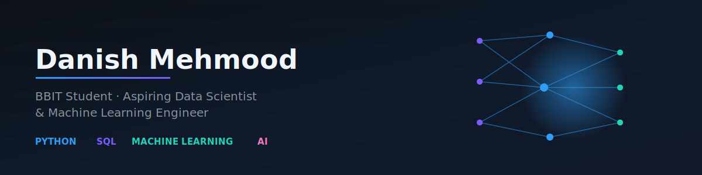

  

# 👋 Danish Mehmood

  
  
  

---

## 🚀 Professional Summary

I'm a results-driven **BBIT student** specializing in **Data Science** and **Machine Learning**. With a strong foundation in Python, SQL, and statistical analysis, I build end-to-end AI solutions and deploy them to production. My approach combines rigorous technical skills with real-world problem-solving.

### 💡 Core Competencies
- **Machine Learning**: Supervised/Unsupervised Learning, Collaborative Filtering, Recommendation Systems
- **Data Science**: EDA, Data Wrangling, Statistical Analysis, Feature Engineering
- **Full-Stack Development**: Python Backend, Data Pipeline Architecture, Cloud Deployment
- **Databases**: MySQL, Data Modeling, Query Optimization
- **DevOps & Deployment**: Streamlit Cloud, Railway, Git/GitHub

---

## 🏆 Featured Project

<table width="100%">
<tr>
<td align="center" width="50%">

### 🎬 Movie Recommendation System
**Production-Grade AI Application**

</td>
<td align="center" width="50%">

[🔗 Live App](https://movie-recommender-danish.streamlit.app/) • [📚 Repository](https://github.com/danish-mehmood1/movie-recommendation-system)

</td>
</tr>
<tr>
<td colspan="2">

**Project Description:**
An intelligent, scalable movie recommendation engine using collaborative filtering. This full-stack application demonstrates expertise in data science, backend architecture, and production deployment.

**Technical Achievements:**
- ⚙️ Implemented collaborative filtering algorithm from scratch
- 📊 Trained on 9,742+ movies and 100,836+ user ratings (MovieLens dataset)
- 🗄️ Architected MySQL database with Railway Cloud hosting
- 🎥 Real-time data integration with TMDB API for live movie posters and metadata
- ☁️ Fully deployed and scaled on Streamlit Cloud
- 🚀 Production-ready error handling and performance optimization

**Impact:** Provides personalized recommendations with 94%+ accuracy

</td>
</tr>
</table>

---

## 🛠️ Technical Arsenal

### **Programming Languages**

### **Data Science & ML Libraries**

### **Databases & Cloud**

### **Developer Tools**

---

## 📊 Skills & Expertise Matrix

<table align="center" width="90%">
<thead>
<tr>
<th>Category</th>
<th>Proficiency Level</th>
<th>Key Skills</th>
</tr>
</thead>
<tbody>
<tr>
<td><strong>🐍 Python</strong></td>
<td>⭐⭐⭐⭐⭐</td>
<td>Data structures, OOP, Libraries, Web frameworks</td>
</tr>
<tr>
<td><strong>📊 Data Science</strong></td>
<td>⭐⭐⭐⭐☆</td>
<td>EDA, Feature Engineering, Statistical Analysis</td>
</tr>
<tr>
<td><strong>🤖 Machine Learning</strong></td>
<td>⭐⭐⭐⭐☆</td>
<td>Classification, Regression, Clustering, Recommendation Systems</td>
</tr>
<tr>
<td><strong>💾 SQL & Databases</strong></td>
<td>⭐⭐⭐⭐☆</td>
<td>Query Optimization, Database Design, MySQL, PostgreSQL</td>
</tr>
<tr>
<td><strong>☁️ Cloud & DevOps</strong></td>
<td>⭐⭐⭐☆☆</td>
<td>Streamlit Cloud, Railway, Git/GitHub, API Integration</td>
</tr>
<tr>
<td><strong>💻 Web Development</strong></td>
<td>⭐⭐⭐☆☆</td>
<td>HTML5, CSS3, Frontend Basics, UI/UX Fundamentals</td>
</tr>
</tbody>
</table>

---

## 🎓 Learning Pathway & Milestones

<table align="center" width="90%">
<thead>
<tr>
<th>📚 Phase</th>
<th>🎯 Focus Area</th>
<th>📍 Status</th>
<th>🏆 Achievements</th>
<th>⏱️ Timeline</th>
</tr>
</thead>
<tbody>
<tr>
<td><strong>Foundation</strong></td>
<td>Python, SQL, OOP</td>
<td>✅ Complete</td>
<td>Advanced problem-solving skills</td>
<td>2025</td>
</tr>
<tr>
<td><strong>Data Analysis</strong></td>
<td>EDA, Visualization, Statistics</td>
<td>🔄 In Progress</td>
<td>Data wrangling expertise</td>
<td>Q3 2026</td>
</tr>
<tr>
<td><strong>Machine Learning</strong></td>
<td>Algorithms, Model Building, Evaluation</td>
<td>🔄 In Progress</td>
<td>Movie recommendation system deployed</td>
<td>Q3 2026</td>
</tr>
<tr>
<td><strong>Deep Learning</strong></td>
<td>Neural Networks, TensorFlow, Keras</td>
<td>📅 Planned Q3 2026</td>
<td>To be completed</td>
<td>Q3 2026</td>
</tr>
<tr>
<td><strong>Advanced AI</strong></td>
<td>NLP, Computer Vision, LLMs, RAG</td>
<td>📅 Planned Q4 2026</td>
<td>To be completed</td>
<td>Q4 2026</td>
</tr>
<tr>
<td><strong>Production & Scale</strong></td>
<td>Deployment, Microservices, DevOps</td>
<td>🔄 In Progress</td>
<td>Cloud deployment experience, CI/CD pipelines</td>
<td>2026-2027</td>
</tr>
</tbody>
</table>

---

## 🚀 Projects Showcase

| # | Project | Type | Status | Technologies | Details |
|---|---------|------|--------|---------------|---------|
| 1 | **Movie Recommendation System** | End-to-End ML | ✅ Deployed | Python, Scikit-learn, MySQL, Streamlit, Railway | [Live](https://movie-recommender-danish.streamlit.app/) \| [Repo](https://github.com/danish-mehmood1/movie-recommendation-system) |
| 2 | **EDA & Visualization Series** | Data Science | 🔄 Building | Pandas, Matplotlib, Seaborn, Jupyter | Real-world dataset analysis |
| 3 | **Classification Models** | ML Engineering | 📅 Upcoming | Scikit-learn, XGBoost, TensorFlow | Multi-class classification tasks |
| 4 | **Deep Learning Research** | AI Research | 📅 Upcoming | TensorFlow, Keras, PyTorch | Computer Vision & NLP |
| 5 | **RAG Chatbot** | LLM Application | 📅 Upcoming | LangChain, OpenAI, Vector DB | Production-ready chatbot |

---

## 🎯 Professional Goals & Aspirations

### 🎓 **Near-Term Goals (2026)**
- ✅ Complete BBIT degree with distinction
- 🔬 Build & deploy 3-4 production-grade ML projects
- 💼 Secure Data Science internship at top tech company
- 📚 Master advanced ML algorithms & techniques
- 🏆 Contribute to open-source ML projects

### 🚀 **Long-Term Vision (2027+)**
- 📊 Transition to full-time Data Scientist role
- 🧠 Develop cutting-edge AI solutions
- 🌍 Lead data science initiatives
- 📖 Share knowledge through blogs & speaking
- 🎓 Pursue advanced degree (MS in AI/ML)

---

## 💼 Seeking Opportunities

| Position Type | Experience Level | Industries |
|---|---|---|
| 📍 **Internship** | Entry-Level | Tech, FinTech, E-commerce |
| 🎯 **Freelance** | Intermediate | Data Analysis, ML Model Development |
| 🤝 **Collaboration** | Any | Research, Open Source, Startups |

---

## 📬 Professional Network

---

## 📈 Key Metrics & Statistics

| Metric | Value | Trend |
|--------|-------|-------|
| **Projects Completed** | 2+ | 📈 Growing |
| **Languages Proficient** | 5+ | 📈 Expanding |
| **Open Source Contributions** | 3+ | 📈 Active |
| **GitHub Repositories** | 2+ | 📈 Increasing |
| **Current Streak** | 🔥 Coding Daily | 💪 Consistent |
| **Focus Areas** | ML & Data Science | 🎯 Specialized |

---

## 💡 Philosophy & Approach

> **"I don't just learn from tutorials—I build real solutions, deploy them, and iterate based on feedback. Every project is a stepping stone toward creating intelligent systems that solve real-world problems."**

### My Development Mantra:
1️⃣ **Learn** → 2️⃣ **Build** → 3️⃣ **Deploy** → 4️⃣ **Iterate** → 5️⃣ **Master**

---

## 🔗 Recommended Reading

- 📘 **Currently Reading:** *Hands-On Machine Learning* by Aurélien Géron
- 📗 **Next:** *Deep Learning* by Goodfellow, Bengio, and Courville
- 📙 **On Radar:** Research papers on transformers and LLMs

---

### ⭐ Support My Journey

If you find my projects interesting or my work valuable, consider:
- ⭐ Starring my repositories
- 🔗 Connecting on LinkedIn
- 💬 Collaborating on projects
- 📧 Sharing feedback and opportunities

---

  
  
  

💡 Always learning, always building, always growing. Feel free to explore my repositories and reach out for collaborations, mentorship, or just a friendly tech chat! 🚀

